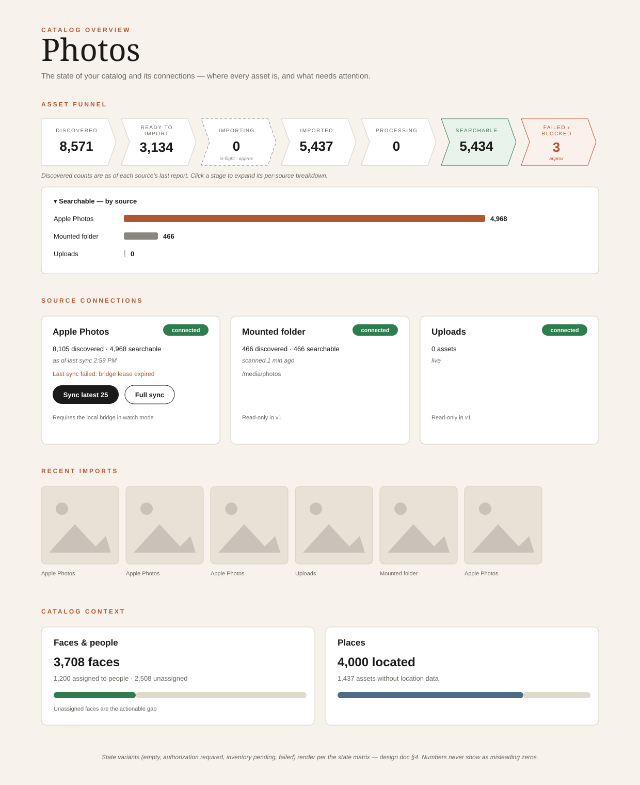

# Catalog Overview — Design (v1)

## 0. Approval trail

- **Requirements contract:** `catalog-overview-spec.md` (distilled 2026-09-15).
- **Source representation:** real `sources` rows for `mounted_folder` and
  `uploads`, `assets.source_id` set at import time, existing assets backfilled
  by path classification.
- **Aggregation approach:** one `GET /catalog/overview` endpoint; all
  derivation server-side; the web page is a thin renderer with a state matrix.
- Materialized stats table explicitly rejected (dual bookkeeping, ruled out by
  the spec).

## 1. Architecture overview

A new `GET /catalog/overview` endpoint (new `apps/api/api/catalog.py` router,
registered under the `/catalog` prefix) returns the complete page model in a
single response: the rollup funnel, per-source entries (readiness, stage
counts, freshness), and context blocks. Every derived number is computed
server-side from existing tables; the rollup is the sum of per-source stage
counts, so there is exactly one derivation path and no contradictory counts.

The Photos page (`apps/web/app/photos/page.tsx`) is rebuilt as a thin renderer
driven by a state matrix. Existing Apple Photos sync endpoints and controls are
unchanged.

Data model changes:

- Seed `mounted_folder` and `uploads` rows in `sources`.
- Worker assigns `assets.source_id` at import time via a shared classifier.
- Migration backfills `assets.source_id` for existing rows.
- Add `assets.created_at` so "recent imports" means *imported*, not *taken*.

## 2. Components

### 2.1 `core/sources.py` — path classification

Add `classify_path(path: str) -> str`, the single place that maps a file path
to a source kind:

- under `<PICS_LIBRARY>/apple-photos/` → `apple_photos`
- under `<PICS_LIBRARY>/imports/` → `uploads`
- under `<PICS_WATCH_ROOT>` → `mounted_folder`

Reads the same environment variables (`PICS_LIBRARY`, `PICS_WATCH_ROOT`) with
the same defaults as the existing modules. Used by the worker import pipeline,
the migration backfill, and the overview endpoint — classification logic
exists exactly once.

### 2.2 `core/schema.py` — migration

In `migrate`:

- `INSERT OR IGNORE` sources rows: `('mounted_folder', 'Mounted folder')` and
  `('uploads', 'Uploads')`, mirroring the existing `apple_photos` seed.
- Add `created_at TEXT` to `assets` via the existing `ALTER TABLE` pattern.
  Existing rows keep NULL; the UI falls back to `taken_at` for display.
- Backfill: `UPDATE assets SET source_id = <id> WHERE source_id IS NULL` per
  source, matching paths via `classify_path` semantics (prefix match on the
  library/watch-root prefixes). Apple Photos rows already carry `source_id`.

### 2.3 Worker import pipeline

When the worker creates an asset row during an import job, set `source_id`
from `classify_path(path)`. No other worker behavior changes; thumbnails,
EXIF, faces, and embeds proceed as today.

### 2.4 `apps/api/api/catalog.py` — overview endpoint

`GET /catalog/overview` returns:

```json
{
  "generated_at": "2026-09-15T15:00:00+00:00",
  "funnel": {
    "discovered": 8571,
    "ready_to_import": 3134,
    "importing": 0,
    "imported": 5437,
    "processing": 0,
    "searchable": 5434,
    "failed_or_blocked": 3
  },
  "sources": [
    {
      "kind": "apple_photos",
      "display_name": "Apple Photos",
      "readiness": "connected",
      "readiness_detail": null,
      "reported_at": "2026-09-15T14:59:16+00:00",
      "stages": { "discovered": 8105, "ready_to_import": 3134, "importing": 0,
                  "imported": 4971, "processing": 0, "searchable": 4968,
                  "failed_or_blocked": 3 },
      "sync": { "id": 12, "status": "error", "full_sync": 1,
                "imported_count": 0, "failed_count": 0,
                "error": "bridge lease expired",
                "requested_at": "...", "completed_at": "..." },
      "actions": { "can_sync": true }
    }
  ],
  "context": {
    "recent_imports": [ { "id": 1, "source_kind": "apple_photos",
                          "original_filename": "IMG_1234.HEIC",
                          "imported_at": "...", "taken_at": "..." } ],
    "faces": { "total": 3708, "assigned": 1200, "unassigned": 2508 },
    "places": { "located": 4000, "unlocated": 1437 }
  }
}
```

Notes on the contract:

- `funnel` is exactly the sum of `sources[].stages` — the server sends both so
  the client never does arithmetic.
- `readiness` is one of `not_configured`, `authorization_required`,
  `inventory_pending`, `connected`, `failed`. `readiness_detail` carries a
  human-readable reason (e.g. the last error) when present.
- `reported_at` is the freshness label: `sources.last_sync_at` for Apple
  Photos, the inventory scan's wall-clock cached-at for the mounted folder,
  `null` (live) for uploads.
- `sync` is the latest `source_syncs` row for bridge-backed sources; `null`
  otherwise. `actions.can_sync` is true only for Apple Photos today.
- The mounted folder reuses `_cached_library_inventory` from `admin.py`; the
  cache gains a wall-clock timestamp alongside the existing monotonic one.

### 2.5 Web page

- `apps/web/types.ts`: `CatalogOverview`, `SourceOverview`, `FunnelStages`,
  `Readiness` types mirroring the contract.
- `apps/web/lib/api.ts`: `catalogOverview()` fetcher.
- `apps/web/app/photos/page.tsx`: rebuilt into four sections (see §4).

## 3. Stage derivation contract

This table is the documented definition of every number on the page. Per
source, then summed for the rollup:

| Stage | Apple Photos | Mounted folder | Uploads |
|---|---|---|---|
| Discovered | `sources.asset_count` | scan `media_files` | = imported (discovered on arrival) |
| Ready to import | discovered − known `source_asset_id`s (deleted=0) | discovered − assets under watch root | 0 |
| Importing | active `source_syncs` (queued/running); approximate, labeled in-flight | paths in queued/working scan/import jobs, classified via `classify_path` | same as mounted |
| Imported | `assets` by `source_id`, `deleted = 0` | same | same |
| Processing | imported, no `content_embeds`, referenced by a queued/working import job | same | same |
| Searchable | imported with a `content_embeds` row | same | same |
| Failed/Blocked | latest sync `error`/`partial` (failed_count) + stuck* | failed import/scan jobs + stuck* | failed import jobs + stuck* |

\* **stuck** = imported, no `content_embeds`, and not referenced by any
queued/working import job. This surfaces the historically invisible gap
between "uploaded" and "processed" (e.g. 4,968 searchable vs 4,971 imported).

Readiness derivation (per source, from `sources` + latest `source_syncs`):

- `not_configured` — status `not_connected`, never synced.
- `authorization_required` — `authorization_state` is `denied`, `restricted`,
  or `notDetermined`.
- `inventory_pending` — connected but `asset_count = 0` and no completed sync.
- `connected` — otherwise healthy.
- `failed` — latest sync `error`, or `sources.last_error` set, or (mounted
  folder) watch root unavailable. Last-known inventory is preserved and shown
  alongside the failure.

## 4. UI structure and state matrix



_Low-fidelity wireframe: `catalog-overview-design-diagram.svg` (SVG, editable
by hand or in any vector tool). Numbers shown are illustrative, matching the
worked example in §2.4._

Page sections, top to bottom:

1. **Funnel bar** — the seven rollup stages as connected steps; each stage
   expands to show per-source rows. Stages with approximate semantics
   (Importing, Failed/Blocked) carry an "approx." affordance and a tooltip
   explaining the derivation.
2. **Source connections** — one card per source: readiness badge, key stage
   numbers, freshness ("as of last sync, 2:59 PM"), latest error when failed.
   The Apple Photos card keeps the existing actions (Sync latest 25, Full
   sync) and live sync progress; other sources are read-only in v1.
3. **Recent imports** — latest assets by `created_at` (fallback `taken_at`),
   labeled with their source.
4. **Catalog context** — faces (total, assigned vs unassigned to people) and
   places (assets with vs without location).

State matrix per section: loading skeleton; empty (no sources connected);
`authorization_required` (call to action, no zeros); `inventory_pending`
("waiting for source inventory"); active sync (3 s polling, reusing the
existing pattern, refetching overview); `failed` (error detail, last-known
numbers preserved, read-only).

## 5. Data flow

1. Page load → `GET /catalog/overview` → single response → render all
   sections.
2. User triggers sync → existing `POST /sources/apple-photos/sync` → page
   polls sync status every 3 s and refetches the overview while active.
3. Bridge uploads / folder scan / manual upload → import job → worker creates
   asset with `source_id` → embeds written → next overview fetch reflects the
   funnel movement.
4. Mounted-folder numbers flow through the existing 60 s inventory cache, so
   overview requests never trigger a stampede of filesystem walks.

## 6. Key decisions (hard to reverse)

- **`sources` rows + `assets.source_id` backfill** for mounted folder and
  uploads — schema and data migration; future sources follow the same pattern
  through the existing source interface (no plugin system).
- **`assets.created_at`** added; import-time ordering depends on it going
  forward.
- **`/catalog/overview` response contract** — additive-only changes after
  this; the web app depends on its shape.
- **Stage derivation rules (§3)** become the canonical definition of every
  count shown to the user; changing a definition later is a product decision,
  not a refactor.

## 7. Error handling

- **Watch root unavailable** → mounted source readiness `failed` with
  `readiness_detail` from directory errors; other sources render normally.
- **Inventory scan stale/failed** → last cached values served with their
  timestamp; never blocks the endpoint.
- **Bridge lease expiry / sync failure** → recovered server-side as today;
  surfaced as `failed` readiness with the last error and last-known inventory
  preserved.
- **Overview endpoint failure** → page-level error state; the Apple Photos
  sync controls remain usable (they hit separate endpoints).
- **Partial derivation failure** (e.g. jobs table unreadable) → 500; no
  partial numbers are ever rendered as if complete.

## 8. Testing approach

- **pytest (`apps/api/tests`)**, following existing patterns:
  - stage derivation per source against seeded databases (including the stuck
    case: imported, no embeds, no active job);
  - readiness transitions across `sources`/`source_syncs` states;
  - backfill migration: NULL `source_id` rows classified by path;
  - endpoint contract: rollup equals the sum of per-source stages.
- **vitest (`apps/web`)**: page renders each state-matrix state against a
  mocked `catalogOverview()`; funnel stage expansion shows per-source rows;
  Apple Photos card renders actions and error states.
- No worker tests beyond asserting `source_id` is set on import (extend the
  existing worker test fixtures).
