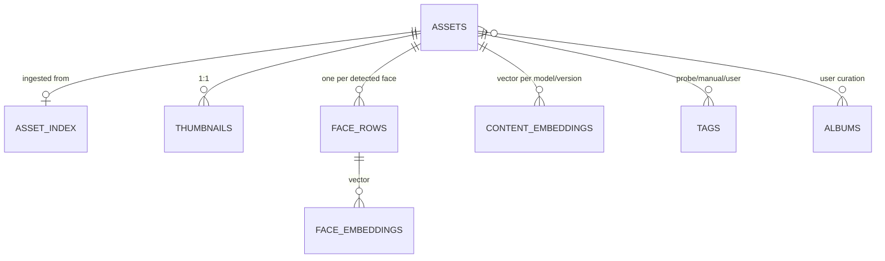
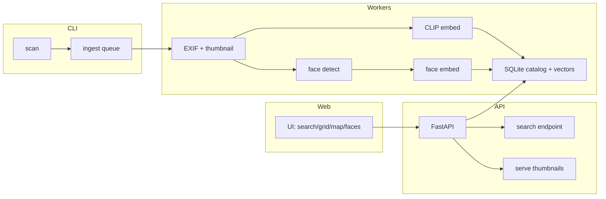
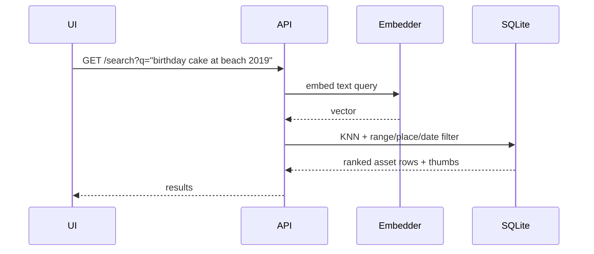

# Photo Searchable Library — Discovery

## 1. Summary

The problem: a personal photo library (<20k photos) lives on disk with rich
metadata baked into the files (date, GPS, camera) but no way to query it except
by folder name and manual browsing. The goal is to make those photos searchable
— by *you* (human, natural-language queries) and by *AI models* (a programmatic
index/API). A photo `search "birthday cake"` should return the right files, and
`search "Sam and the kids at the beach in 2019"` should work too.

The core idea is **decoupling indexing from the files themselves**. On ingest,
each photo goes through a pipeline that extracts three classes of metadata:

1. **Structured metadata** — pulled straight out of the file: timestamp, GPS
   coordinates, camera, lens. This is cheap (~μs per photo) and nearly free with
   ExifTool.
2. **Derived place metadata** — GPS coordinates converted to human place names
   (country / city / beach) via reverse geocoding, so searches like "in
   Portugal" or "at Memorial Park" work even though the file only has lat/lng.
3. **AI-derived content metadata** — what's actually *in* the photo: objects,
   scenes, people, aesthetics. This is where the value is. A CLIP-style
   multimodal model produces a dense numeric *embedding* per photo (and a
   *face embedding* per person), which lets us answer open-ended natural
   language queries, not just fixed tags.

Everything is stored in an **SQLite "catalog" database** (metadata rows +
embedding vectors via sqlite-vec) that lives next to — but is logically
independent from — the photo files. The original files can stay untouched, be
EXIF-stripped, or be moved; the searchable index doesn't depend on them. Because
the index is separate, an eventual "strip EXIF from photos" feature degrades
search gracefully: file-level metadata can be deleted while the index retains
what's needed.

The front-end is a web UI (grid browse, search box, map, faces) backed by a
local API, with CLI tools for batch operations. Because the whole index is
files-on-disk SQLite + local model inference, this is a hybrid privacy posture:
**all analysis runs on-device by default; cloud/GPU model calls are opt-in**
for better quality (e.g., a stronger captioner) when the user allows it.

## 2. In-depth review

### Pipeline stages

The ingest pipeline is the heart. Every new photo (or batch) flows through:

```
scan → decode/demux → extract EXIF
                       ├── GPS → reverse geocode → place tags
                       ├── timestamp
                       └── camera/lens/ISO
snapshot → thumbnail (JPEG/WebP, e.g. 512px)
embed    → CLIP image embedding (content)
faces    → face detect → cropped face → face embedding (per person)
caption  → (optional, quality tier) object/scene caption or tag list
store    → upsert into SQLite catalog (asset_rows + vec0 embedding tables)
```

Configuration is per-*library* (a folder tree). New files are detected with a
watchdog or a rescan; existing files are left alone if their content-hash and
index row match (idempotent ingest, re-runnable).

### Metadata extraction

| Source | What | Tooling |
|---|---|---|
| EXIF/GPS/XMP/IPTC | time, coords, camera, lens, orientation | **ExifTool** (gold standard; reads/writes anything; `-json` output) or pure-Python `Pillow` for basics; **Exiv2** bindings as an alternative |
| HEIC / AVIF / MOV | container decode + thumbnails | `pillow-heif` (Python) or `heif-convert`; ffmpeg handles video |
| RAW (CR2/NEF/ARW) | embedded JPEG preview used for thumb + embedding | `rawpy` or ExifTool previews |
| timestamps | files lacking EXIF | file mtime fallback; sidecar/manual |

Key gotcha: **mobile files (HEIC, HEIF) are not natively decodable by Pillow**;
they need `pillow-heif` (uses libheif) and pip installs of native wheels.
Videos (MOV/MP4) need ffmpeg for thumbnail extraction and have their own EXIF
tags (ExifTool reads those too).

### Embedding for content search

The workhorse is a **CLIP-style contrastive model** — it maps images and text
into one shared vector space so that "a birthday cake" (text) sits close to a
photo of a birthday cake (image). Two embedding paths:

- **Image embedding per photo** (one vector per asset). At query time, embed
  the user's text query and compute cosine similarity against all image
  embeddings. Top-N results = answer.
- **Zero-shot classification** (optional): a closed tag list
  (`["birthday", "hiking", "grandma", ...]`) can be pre-computed once and
  stored as a per-photo confidence vector, making fixed-tag search instant.

Model choices (local-first):

- **OpenAI CLIP ViT-B/32** — the reference; MIT license, well-understood, ~350MB.
- **OpenCLIP** (mlfoundations) — same family, more/stronger checkpoints.
- **MobileCLIP (Apple, S0–B)** — 2–4x faster on CPU hardware, near-SOTA quality,
  GPL-ish Apple license, ideal for on-device batch embedding of 20k photos.
  Best default for a Mac bring-your-own-GPU budget.

For 20k images, embedding is a batch compute task not a realtime one. On a
MacBook with Apple Silicon + Metal, MobileCLIP-S0 does this in minutes–tens of
minutes; even plain OpenAI CLIP on CPU is feasible (1–5 s/photo → ~1–1.5
hour wall clock for 20k). Embed some; the index is expected to be re-embedded
rarely (only when you swap models).

People are a special content case: a generic CLIP embedding does **not**
identify "is this Mom". Handling people needs an explicit **face embedding**
step (see next). Content-based search is complementary to face search.

### Face recognition & clustering

Faces are "who is in the photo?" — requires face detection + embedding + a
clustering/reference step, different from content CLIP:

1. **Detect + align** faces in each image (RetinaFace / MTCNN / AAAI; on macOS
   the Vision framework via `pyobjc-framework-Vision` can be used too).
   Produce a crop + bounding box per face.
2. **Embed** each aligned face (FaceNet/ArcFace/insightface) into a ~512-dim
  , stable identity vector.
3. **Cluster** the faces across the whole library (bottom-up nearest neighbor
   e.g. DBSCAN or the "never merge two large clusters" heuristic that
   PhotoPrism/Immich use) to assign an anonymous cluster id. Human review then
   surfaces ambiguous crops.

People then become searchable: `who:Sam` filters to photos whose face-embedding
matches Sam's cluster prototype. This is the hardest part of the pipeline, and
it is the most license/legal sensitive (face data is personal data). Keep all of
it local / in the SQLite index.

### Face identity UX (who names it, and how)

The pipeline is explicitly **automatic-up-to-a-cluster, human-confirms-the-name**.
Per-photo labeling would be the worst possible UX (20k photos); cluster-level
naming is the right zoom:

- **Automatic pass (no user)**: each upfront run auto-detects+embeds+clusters
  faces into anonymous groups. The "never-merge-two-large-clusters" guard means
  a recurring person (e.g. Mom, appearing in 86 faces over years) is never
  swallowed by noise.
- **First-run "name the people" view**: the app shows several representative
  crops per cluster (the centroids — the faces whose embedding is most typical
  of that cluster). User clicks: "Mom", "Sam", "this is me". ~5–10 minutes for
  a whole library when clusters are good. No per-photo tagging.
- **Review furniture (cluster-level, required)**: a People page lets you
  *merge* clusters (same person split), *split* a cluster (two people grouped
  together), and *rename*. Review is always at cluster level — the mapping of a
  face-crop → cluster is derived, so splitting/merging re-derives all member
  photos automatically.
- **Search after naming**: `who:Sam` = KNN against Sam's stored cluster
  prototype(s). It's an index lookup, re-run cost zero.

Optional smart extras (later):

- **Anchor-from-reference**: point at `refs/sam.jpg`, `refs/mom.jpg` — those
  become anchor embeddings and auto-name their nearest clusters; the user only
  reviews the misses. (No auto-ID from your address book/contacts — not
  appropriate locally.)
- **High-confidence auto-suggestion**: clusters that match an anchor within a
  very tight distance threshold get a provisional name, still confirmed in one
  click.

Honest gotchas to budget for:

- A person's face changes over 10+ years, angle extremes, toddlers, and the
  same-person-different-haircase all cause cluster split/merge errors. The
  merge/split-at-cluster UI is a functional requirement, not a nice-to-have.
- Keep all face embeddings + cluster assignments **local** (SQLite). If a
  future feature ever syncs to cloud, faces must either stay local or be
  aggregated to obfuscated embeddings with user consent.

### Place

GPS (lat/lng) from EXIF must become human-readable. Approaches:

- **Local reverse-geocoder with a bundled gazetteer** — e.g., `reverse_geocoder`
  (p/c, city/country level, ships ~140MB div file, works offline, MIT).
  Good enough for "in city/country/region" queries.
- **Nominatim / Geocode.earth / county + OpenStreetMap / Google** — online,
  gives building/road level but sends coordinates off-device; rate limits (1
  req/s for Nominatim) troublesome for 20k rows but fine for a one-time cache
  keyed on (lat,lng).
- **Offline OSM-based reverse** is slower/more setup but highest quality
  locally.

Recommended default: hybrid — ship a small offline gazetteer for city/country
(covers most queries), plus an optional Nominatim enable flag for landmark-level
labels.

### Index storage: SQLite + sqlite-vec

For <20k items, no heavyweight vector DB is needed. Store:

- A `assets` table (per photo: id, path, sha256, exif json, place geocode,
  content embedding id, extracted at timestamps, strip-status flag, per-model
  version).
- `files` tables for file identity (content-addressed blob hash) → dedupe.
- `faces` table + `face_embeddings`.
- `tags` table (CLIP text-probe tags, manual user tags, place tags).

`sqlite-vec` (Alex Garccia, Mozilla Builders project) adds `vec0` virtual tables
to SQLite, storing float/int8 vectors and doing exact/approx KNN
`M->distance` queries — this is attractive because **the metadata (SQL) and the
vectors live in the same DB**, so query `SELECT * FROM assets WHERE `wheres
drive both an exact-SQL edge and a vector proximity edge in one engine.
Alternative pass on vectors: use a Bloom/approx library (FAISS/Chroma) — heavier
but for 20k, sqlite-vec exact is enough. Pre-v1, pin version.

Query flow for `search "coconut cake"`:
1. Embed text → 512-dim query vector.
2. `SELECT * FROM assets JOIN vec0 on … ORDER BY distance LIMIT 20`.
3. Post-filter/boost with structured filters: place, dates range, faces/people.

### The "strip EXIF but keep searchable" feature

Since the index is the source of truth and it was built in pass 1, stripping the
original file (ExifTool `-all=` writes a clean copy) doesn't hurt search: the
catalog keeps the needed fields with a `stripped: true` column, and GDPR-like
option "forget my location" can null the derived-coords in the index while
keeping searchable place names, all under a permission-checked API.

### Shapes the software — hybrid TypeScript + Python

The stack decision is driven by *where the ML lives*, not taste:

- The embedding/face-detection stack (OpenCLIP, MobileCLIP, insightface,
  deepface, pillow-heif, rawpy) is Python-first — the `torch`/`transformers`
  ecosystem. JS can run models via ONNX.Runtime / transformers.js, but face
  identity & clustering, HEIC/RAW decode, and exotic model variants are all
  fighting the ecosystem there.
- The web layer (search box, grid, map, faces, album editing) is a natural
  React/Next.js app — and Next.js can be the primary web server, exposing
  browse/search/thumbnail endpoints as route handlers or tRPC.

So the recommended monorepo:

```
apps/web        Next.js (UI + web API for browse/search/thumbnails)
apps/api        FastAPI (search, metadata, face-merge endpoints)  [thin]
services/worker Python (ingest → EXIF/thumb → CLIP embed → face)  [queued]
```

TypeScript never touches a model directly; it talks to the Python service over
HTTP or a queue.

Territory where pure Next.js *would* make sense: accepting ONNX-only models,
no torch, everything in-process, and keeping the quantity small. For <20k that
is plausibly workable today, but face identity + HEIC remain the awkward bits —
hybrid is the pragmatic default.

**Async job processing**: scanning/embeddings are slow and batch; index/rebuild
tasks must be queued and progress-reportable to the web UI (SQLite-backed job
table or a lightweight queue like RQ/ARQ; do not block the API).

## 3. Architecture diagrams





Sequence for a search:



## 4. Use cases

1. **Personal archive browsing** (`<20k`, self-hosted): full pipeline, all
   local, SQLite + sqlite-vec, thumbnail-served web UI. This is the core;
   the rest are variations. (fits: yes; doesn't fit: multi-user sync /
   mobile auto-backup at scale.)

2. **Privacy-conscious strip**: EXIF-strip old photos but keep cataloged
   metadata; must respect the separate index design. (fits: local-first; needs
   care around face data "amnesia").

3. **AI/app integration**: MCP-grade API endpoints (search, list, faces, place,
   raw thumbnail bytes) so an AI agent or other app can query photos
   programmatically instead of the user typing into a UI. (fits: yes — the
   strict index/API boundary is exactly this.)

4. **"Google-Photos-like" convenience sharing**: multi-user uploads + album
   sharing, search across multiple libraries. (fits: only if you build
   auth/users; discover relevant: Immich already does this and is the
   reference/competitor to not-rebuild.)

## 5. Alternatives

| Alternative | What it is | Comparison |
|---|---|---|
| **Immich** | Self-hosted Google-Photos replacement (NestJS+React, +ML), built-in CLIP search, face recognition | Mature, batteries-in-SQL/API; **biggest alternative**. But it's a full product (mobile apps backup), comes to own server stack; license AGPLv3; you asked for a monorepo you own. |
| **PhotoPrism** | Self-hosted photo manager (Go), location, faces, taging | Embedded CLIP search. Codebase is Go monolith; faces/CLIP modest; deeper 3rd-party extension limited. |
| **PhotoOrganizer / digiKam** | Desktop local indexing | No web API / AI search; not scriptable server-side. |
| **FAISS / Chroma / Qdrant** | Purpose-built vector DBs | For <20k vectors, overkill; sqlite-vec keeps everything in one SQLite file. FAISS= in-process, memory; Chroma = embedding-store in app. |
| **Cloud AI (OpenAI Vision / Google Vision API)** | Highly quality tags | Requires uploading your photos — violates local-first; keep off-path except optional "enhance tags" (already tagged for cloud) but the embedding/local people stay offline. |

**Key takeaway**: Do **not** rebuild a megaproduct like Immich; build a lean
monorepo around the index + optional generous CLI but leave bulk features
(users/sync) for later. Steal Immich/PhotoPrism *ideas* (CLIP, face
clustering, watch-folder, striped-thumbnails) for reference.

## 6. Limitations, risks & gotchas

- **License & privacy**: face vectors are personal data; keep local, document
  user rights. CLIP/Model licenses (OpenAI CLIP MIT; MobileCLIP ARPL; deepface
  MIT but wraps VGG/FaceNet model licenses) — audit if you later OSS. AGP L
  "but more the user to choose" — ask before adding cloud steps.
- **HEIC/RAW/Videos**: naive libraries can't open them; the momentary spec for
  thumbnail+EXIF differs per type; test a diverse sample early (ratio of
  files that are non-JPEG).
- **Face clustering accuracy**: faces at extreme angles, unframes, very young
  children, same person over 10 years — clusters will be imperfect; plan a
  "merge/split person" UI for review. Do not expect 100%.
- **Embedding model drift**: change CLIP model → *all* embeddings change →
  re-embed whole library. Version your embedding model per column and keep
  cached per-model.
- **Face naming is human review, not magic**: the machine auto-clusters; a
  person's name always comes from the user at cluster level. Expect and ship
  the merge/split/rename People page (§ face identity UX).
- **sqlite-vec pre-v1**: breaking changes in minor versions; pin version and
  the SQL vocab; export/reattach budgeting for backups or make it optional.
- **Reverse-geocoding quality**: offline gazette is city-level; if you need
  "which beach/street", you need OSM-level which is a much bigger chunk to
  ship/index. City-level first, feature-flag the rest.
- **EXIF-stripping is destructive**: always on-copy, keep catalog as source,
  and journal status so nothing is unrecoverable.
- **No magic "understand me"**: CLIP finds *what/where, not nuance*; names of
  people comes from face-cluster, not auto. Expect recall/precision tradeoffs
  and a "search is a spread, not exact match" mental model. Test-drive with a
  small subset before indexing 20k.

## 7. References

- [OpenAI CLIP](https://github.com/openai/CLIP) — the contrastive image-text model
- [OpenCLIP](https://github.com/mlfoundations/open_clip) — independent CLIP checkpoints/training
- [Apple MobileCLIP (S0–S2)](https://huggingface.co/apple/MobileCLIP-S2) — fast mobile/CORE checkpoints
- [sqlite-vec](https://github.com/asg017/sqlite-vec) — vector search in SQLite (Mozilla Builders)
- [DeepFace](https://github.com/serengil/deepface) — face detection/recognition/attribute wrapper in Python
- [ExifTool](https://exiftool.org) — the gold standard native metadata read/write
- [reverse_geocoder](https://github.com/thampanr/reverse_geocoder) — offline reverse geocoding from GeoNames
- [Immich](https://github.com/immich-app/immich) — self-hosted photo/video management reference architecture
- [pillow-heif](https://github.com/bigcat88/pillow_heif) — HEIC/HEIF support for Python